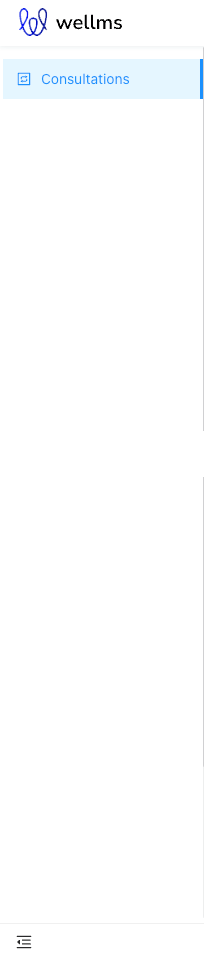
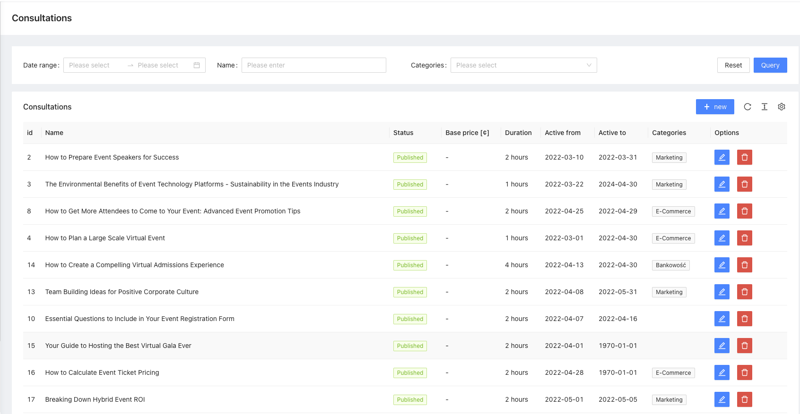
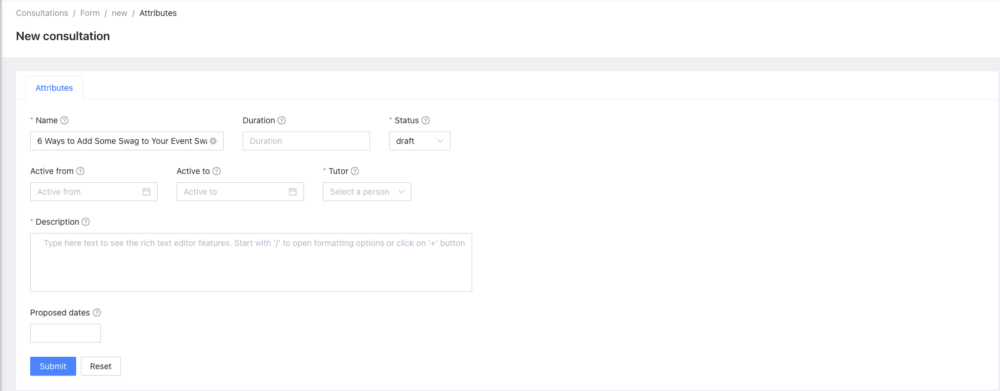

# Consultations
One to one conversation package

[](https://escolalms.github.io/Consultations/)
[](https://codecov.io/gh/EscolaLMS/Consultations)
[](https://github.com/EscolaLMS/Consultations/actions/workflows/test.yml)
[](https://packagist.org/packages/escolalms/consultations)
[](https://packagist.org/packages/escolalms/consultations)
[](https://packagist.org/packages/escolalms/consultations)
[](https://codeclimate.com/github/EscolaLMS/Consultations/maintainability)

## What does it do

This package is used for creating Consultation for EscolaLms.

## Installing

- `composer require escolalms/consultations`
- `php artisan migrate`
- `php artisan db:seed --class="EscolaLms\Consultations\Database\Seeders\ConsultationsPermissionSeeder"`

## Schedule

- In App\Console\Kernel to method schedule add
  - `$schedule->job(new ReminderAboutConsultationJob(ConsultationTermReminderStatusEnum::REMINDED_HOUR_BEFORE))->everyFiveMinutes()` - reminder about to consultation before one hour, executed every 5 minutes
  - `$schedule->job(new ReminderAboutWebinarJob(ConsultationTermReminderStatusEnum::REMINDED_DAY_BEFORE))->everySixHours();` - reminder about to consultation before one day, executed every 6 hours

## Endpoints

All the endpoints are defined in [](https://escolalms.github.io/Consultations/)

## Tests

Run `./vendor/bin/phpunit --filter=Consultation` to run tests. See [tests](tests) folder as it's quite good staring point as documentation appendix.

Test details [](https://codecov.io/gh/EscolaLMS/Consultations) [](https://github.com/EscolaLMS/Consultations/actions/workflows/test.yml)

## Events

- `EscolaLms\Consultations\Events\ApprovedTerm` => Event is dispatched when trainer approved term reported with buyer. Event refers to users, who have permissions students
- `EscolaLms\Consultations\Events\ApprovedTermWithTrainer` => Event is dispatched when trainer approved term reported with buyer. Event refers to users, who have permissions tutor
- `EscolaLms\Consultations\Events\ChangeTerm` => Event is dispatched when trainer changes term in buyed consultations. Event refers to users, who have permissions students
- `EscolaLms\Consultations\Events\RejectTerm` => Event is dispatched when trainer rejects term reported with buyer. Event refers to users, who have permissions students
- `EscolaLms\Consultations\Events\RejectTermWithTrainer` => Event is dispatched when trainer rejects term reported with buyer. Event refers to users, who have permissions tutor
- `EscolaLms\Consultations\Events\ReminderAboutTerm` => Event is dispatched after execute cron job `EscolaLms\Consultations\Jobs\ReminderAboutConsultationJob`, Event is dispatched when deadline for purchased consultation before 1 hours and 1 day. Event refers to users, who have permissions students
- `EscolaLms\Consultations\Events\ReminderTrainerAboutTerm` => Event is dispatched some time before start consultation. Event refers to users, who have permissions tutor
- `EscolaLms\Consultations\Events\ReportTerm` => Event is dispatched after reported term with buyer consultation

## Listeners

- `EscolaLms\Webinar\Listeners\ReminderAboutTermListener` => Listener execute a method that singed the status in the webinar reminder

## How to use this on frontend.

### Admin panel

**Left menu**



**List of consultations**



**Creating/editing consultation**



### Front Application

...

## Permissions

Permissions are defined in [seeder](vendor/escolalms/consultations/database/seeders/ConsultationsPermissionSeeder.php)

## Database relation

1. `Author` Consultation is related belong to with User
2. `ProposedTerms` Consultation model has many to models ConsultationProposedTerm
3. `Categories` Consultation belongs to many with models Categories
4. `Users` Consultation is related belongs to many with User which bought consultation
5. `Terms` Consultation model has many to models ConsultationUserPivot. It is reported terms
```
Consultation 1 -> 1 Author
Consultation 1 -> n ProposedTerms
Consultation 1 -> n Categories
Consultation 1 -> n Users
Consultation 1 -> n Terms
```
