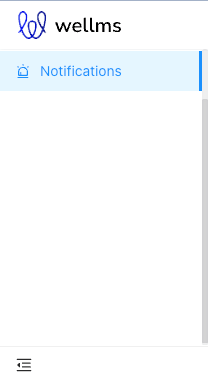
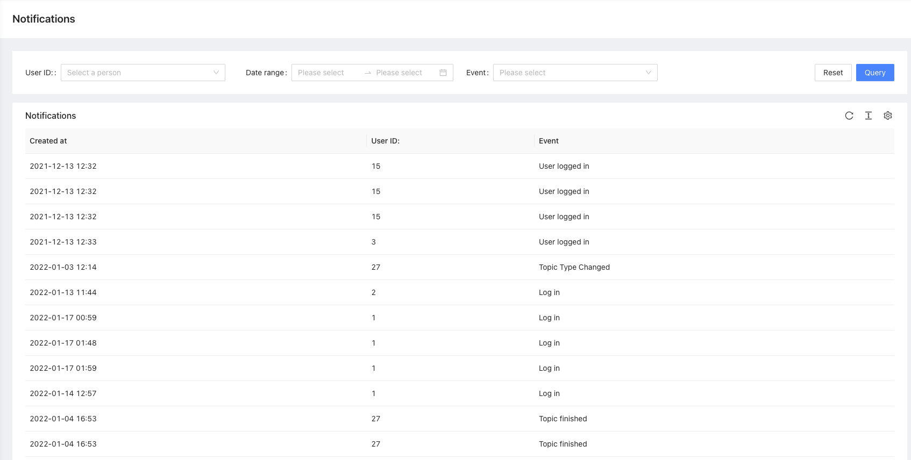

# Notifications

Notifications package

## What does it do

This package is used for logging and broadcasting notifications for all `EscolaLms` packages events.

## Installation

- `composer require escolalms/notifications`
- `php artisan migrate`
- `php artisan db:seed --class="EscolaLms\Notifications\Database\Seeders\NotificationsPermissionsSeeder"`

## Usage

All events emitted by EscolaLms packages will be logged in database and can be listed through API (and Admin Panel).
There is a configuration file in which you can define events which should be excluded from being stored.

## Endpoints

All the endpoints are defined in 

## Tests

Run `./vendor/bin/phpunit --filter 'EscolaLms\\Notifications\\Tests'` to run tests. See [tests](tests) folder as it's quite good staring point as documentation appendix.

Test details:

### Admin panel

#### **Left menu**

#### **List of notifications**

## Permissions

Permissions are defined in [seeder](https://github.com/EscolaLMS/Notifications/blob/main/database/seeders/NotificationsPermissionsSeeder.php)

## Events

No Events are defined in this package.

## Listeners

- `EscolaLms\Notifications\Listeners\NotifiableEventListener` - this listener listens to all events in `EscolaLms` namespace

## Roadmap. Todo. Troubleshooting

- ???
