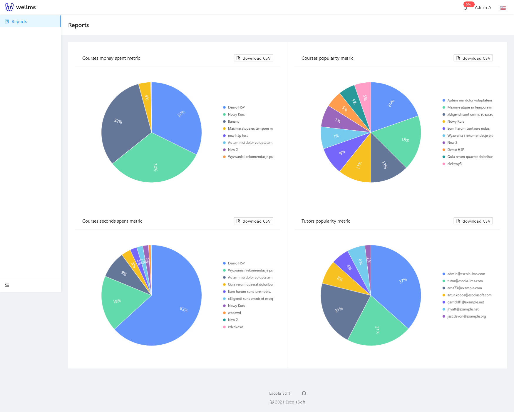
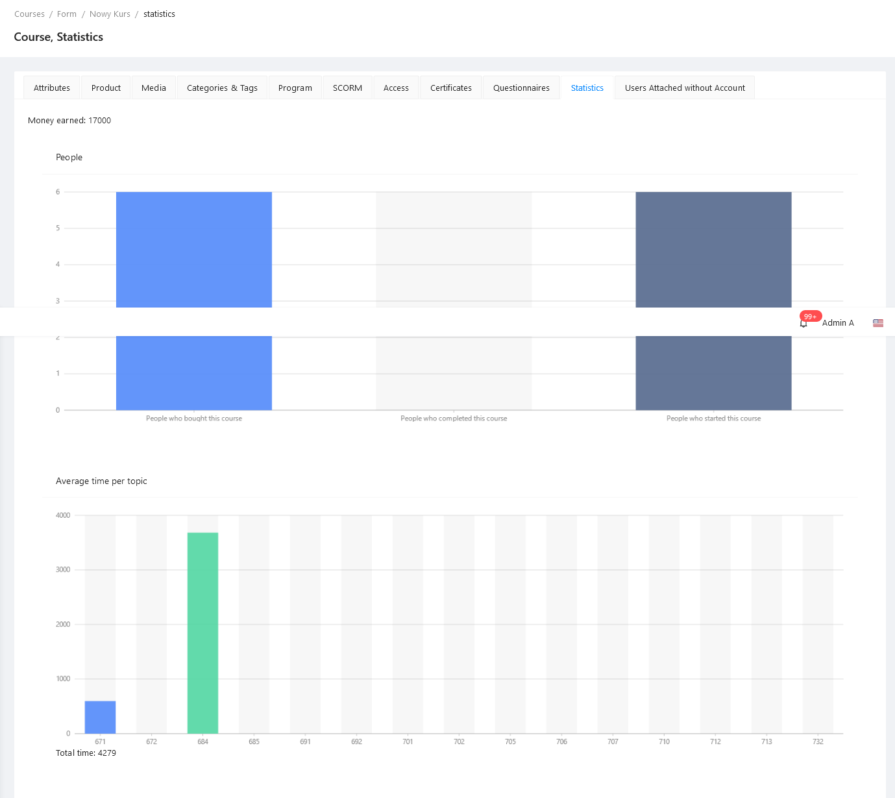

# EscolaLMS Reports

Package for statistics & reports

## Purpose

This package contains web API for retrieving statistical data about other LMS components (or event any arbitrary non-LMS Models for which Metrics and/or Reports are registered).

## Installation

- `composer require escolalms/reports`
- `php artisan migrate`
- `php artisan db:seed --class="EscolaLms\Reports\Database\Seeders\ReportsPermissionSeeder"`
- optional: `php artisan vendor:publish --tag=reports` to publish config file

## Dependencies

- `EscolaLms\Courses` for all Courses related stats and metrics
- `EscolaLms\Cart` for all metrics related to calculating amounts of money spent

## Usage

### Configuration

By editing published config `reports.php` you can:

1. Change which metrics are available in API (by editing `metrics`)
2. Change settings for each Metric (by editing `metric_configuration`)
   1. `limit` defines how many data points will be calculated by default (if you don't pass limit as query parameter); for example: `TutorsPopularityMetric` with `limit` set to 10 will return popularity of 10 most popular Tutors
   2. `history` is a boolean that defines if this metric should be automatically calculated and stored in database
   3. `cron` is cron config which determines how often automatic calculation of metrics happens
3. Change which stats are available in API (by editing `stats`) and to which Model they are mapped

### Stats

Stats are used for calculating some statistical data about given single Model (for example Course or Topic). No historical data is stored, only current data is available.

#### **Available stats**

- `EscolaLms\Reports\Stats\Course\AverageTime` - average time spent on Course by users subscribed to it
- `EscolaLms\Reports\Stats\Course\AverageTimePerTopic` - average time spent on Course by users subscribed to it, grouped by topic
- `EscolaLms\Reports\Stats\Course\MoneyEarned` - sum of money earned by given Course
- `EscolaLms\Reports\Stats\Course\PeopleBought` - count of users that bought given Course
- `EscolaLms\Reports\Stats\Course\PeopleFinished` - count of how many users finished given Course
- `EscolaLms\Reports\Stats\Course\PeopleStarted` - count of how many users started learning given Course
- `EscolaLms\Reports\Stats\Topic\AverageTime` - average time spent on Topic by users subscribed to Course which this topic is part of

#### **Creating your own stat**

To create your own Stat, you need to create class implementing `EscolaLms\Reports\Stats\StatContract`.
After creating a Stat you need to register it by adding it to `stats` array in config file.

### Metrics

Metrics are used for reporting data accumulated over time. Historical data is stored for each day using scheduled job, and requesting a metric returns that historical data (that is, metric values stored at given date).

#### **Available metrics**

- `EscolaLms\Reports\Metrics\CoursesMoneySpentMetric` - calculates total money spent for every Course (historical data represents total money spent up to given date)
- `EscolaLms\Reports\Metrics\CoursesPopularityMetric` - calculates how many users were subscribed to every Course
- `EscolaLms\Reports\Metrics\CoursesSecondsSpentMetric` - calculates how much times users spent learning every Course
- `EscolaLms\Reports\Metrics\TutorsPopularityMetric` - calculates how many users were subscribed to courses created by given Tutor

#### **Creating your own metric**

To create your own Metric, you need to create class implementing `EscolaLms\Reports\Metrics\Contracts\MetricContract`. You can extend `EscolaLms\Reports\Metrics\AbstractMetric` to use default implementations of most of the methods declared in this interface.
After creating a Metric you need to register it by adding it to `metrics` array in config file.

## Endpoints

All the endpoints are defined in .

### Metrics endpoints

1. `GET /api/admin/reports/metrics` returns list of `metrics` configured in `reports.php` config file
2. `GET /api/admin/reports/report` calculates data for chosen metric; you can pass following query parameters to this endpoint:
   1. `metric={classname}` is required; `classname` is one of the `metrics` returned in `/api/admin/reports/metrics` endpoit
   2. `limit={int}` is optional; determines the maximum number of data points that will be returned
   3. `date={date}` is optional; will try to load historical report data for given date or return `404` if there is no data available; without this param, endpoint will return today's data

### Stats endpoints

1. `GET /api/admin/stats/available` returns list of `stats` configured in `reports.php` config file
2. `GET /api/admin/stats/

## Tests

Run `./vendor/bin/phpunit --filter='EscolaLms\\Reports\\Tests'` to run tests.

Test details: 

## Events

No Events are defined in this package.

## Listeners

No Listeners are defined in this package.

## How to use this package on Frontend

### Admin Panel

#### **Reports dashboard**

#### **Course Stats**

## Permissions

Permissions are defined in [Enum](https://github.com/EscolaLMS/Reports/blob/main/src/Enums/ReportsPermissionsEnum.php) and seeded in [Seeder](https://github.com/EscolaLMS/Reports/blob/main/database/seeders/ReportsPermissionSeeder.php).
