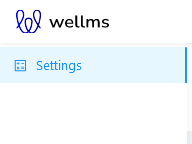
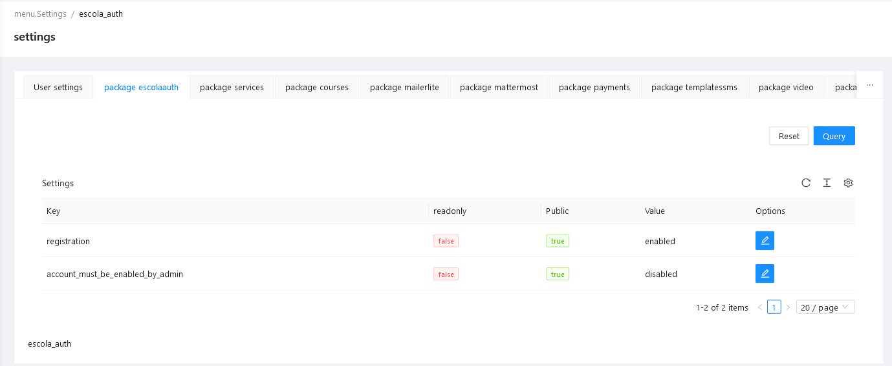
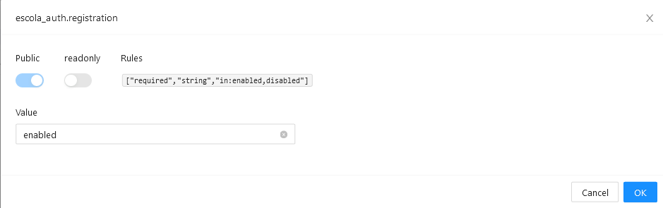

# Settings

Configuration management package

[](https://escolalms.github.io/settings/)
[](https://codecov.io/gh/EscolaLMS/settings)
[](https://github.com/EscolaLMS/settings/actions/workflows/test.yml)
[](https://packagist.org/packages/escolalms/settings)
[](https://packagist.org/packages/escolalms/settings)
[](https://packagist.org/packages/escolalms/settings)

## Purpose

This package can be used to register application config keys which can be then modified through API and/or Admin Panel.

## Installation

- `composer require escolalms/settings`
- `php artisan migrate`
- `php artisan db:seed --class="EscolaLms\Settings\Database\Seeders\PermissionTableSeeder"`
- optional: `php artisan vendor:publish --tag=escola_settings.config` to publish config file

## Dependencies

## Usage

### Configuration

Config file contains `use_database` option, which determines if Config should be written and loaded to database (if `true`), or config files should be overwritten (if `false`);

### Registering config keys

Every package can register config keys by calling `registerConfig` static method from `AdministrableConfig` Facade in its own Package Service Provider `register` method.

```php
use EscolaLms\Settings\Facades\AdministrableConfig;

public function register(){

    //...

    AdministrableConfig::registerConfig($key = 'config_file.config_key', $rules = ['required', 'string'], $public = true, $readonly = false);

}

```

When registering a configuration key you can:

- specify validation rules for values that can be stored (using any of rules available for Laravel validator)
- specify if key is `public` (so anonymous users can retrieve the value)
- specify if key is `readonly` (so it is returned by API but can not be changed using API)

### Loading config

Config will be automatically loaded from database (if `use_database` config options is true). Otherwise, if overwriting config files is chosen, normal Laravel config loading mechanism is used.

### Changing config

`EscolaLms\Settings\Facades\AdministrableConfig` facade can also be used to modify and retrieve values for registered config keys.

```php
AdministrableConfig::setConfig(array $config); // sets config values for any registered config key in $config array, running validation rules
AdministrableConfig::getConfig(); // returns values for all registered config keys
AdministrableConfig::getPublicConfig(); // returns values for config keys registered with public: true
```

These methods are utilised by web API of this package.

### Config Repository Extension & Config Rewriter

This package extends basic `config` Facade of Laravel Framework wrapping it in `EscolaLms\Settings\ConfigRewriter\ConfigRepositoryExtension` decorator. This extended Config repository has a `write` method that can be called to store all in-memory changes to configuration values straight into config files. Writing operation tries to preserve structure of original config files (order of keys, comments, etc.) but it's not always possible (parses this package uses is WIP) and sometimes everything other than keys and values can be removed from config file. Using Database to store modified config values is a safer (non-destructive) option.

## Endpoints

All the endpoints are defined in [](https://escolalms.github.io/settings/).

## Events

- `EscolaLms\Settings\Events\SettingPackageConfigUpdated` emitted when settings are changed using web API.

## Listeners

No Listeners are defined in this package.

## How to use this package on Frontend

### Admin Panel

#### **Left menu**



#### **List of registered Settings for single package (EscolaLms\Auth package used in screenshot)**



#### **Editing registered Setting**



## Tests

Run `./vendor/bin/phpunit --filter 'EscolaLms\\Settings\\Tests'` to run tests. See [tests](https://github.com/EscolaLMS/Settings/blob/main/tests) folder as it's quite good staring point as documentation appendix.

Test details:
[](https://codecov.io/gh/EscolaLMS/settings)
[](https://github.com/EscolaLMS/settings/actions/workflows/test.yml)

## Permissions

Permissions are defined in [Enum](https://github.com/EscolaLMS/Settings/blob/main/src/Enums/ReportsPermissionsEnum.php) and seeded in [Seeder](https://github.com/EscolaLMS/Settings/blob/main/database/seeders/ReportsPermissionSeeder.php).

## Roadmap. Todo. Troubleshooting

- Describe what "Settings" part of this package does (as only "Config" was described, and this package has/had second purpose)
