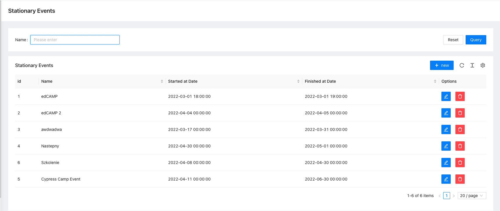

# Stationary Events

[](https://escolalms.github.io/Stationary-Events/)
[](https://codecov.io/gh/EscolaLMS/Stationary-Events)
[](https://github.com/EscolaLMS/Stationary-Events/actions/workflows/test.yml)
[](https://packagist.org/packages/escolalms/stationary-events)
[](https://packagist.org/packages/escolalms/stationary-events)
[](https://packagist.org/packages/escolalms/stationary-events)
[](https://codeclimate.com/github/EscolaLMS/Stationary-Events/maintainability)

## What does it do

This package is used to manage stationary events.

## Installing

- `composer require escolalms/stationary-events`
- `php artisan migrate`
- `php artisan db:seed --class="EscolaLms\StationaryEvents\Database\Seeders\StationaryEventPermissionSeeder"`

## Database

1. `stationary_events` - main table, contains information about the event

   | id | name | description | started\_at | finished\_at | max\_participants | place | program | created\_at | updated\_at | image\_path | short\_desc | status |
      | :--- | :--- | :--- | :--- | :--- | :--- | :--- | :--- | :--- | :--- | :--- | :--- | :--- |
   | 1 | EdCamp 1 | Ratione velit nisi autem et et et. | 2022-07-05 16:57:57 | 2022-07-05 20:57:57 | 105 | Bruenport | NULL | 2022-04-14 08:54:03 | 2022-04-14 08:54:03 | NULL | Et nihil et ut laudantium consequatur quasi architecto et et laudantium. | draft |
   | 2 | EdCamp 2 | Qui maxime aut fugit quam ea similique. | 2022-06-19 07:18:33 | 2022-06-19 10:18:33 | 52 | Meggiemouth | NULL | 2022-04-14 08:54:04 | 2022-04-14 08:54:04 | NULL | Dignissimos libero impedit eos omnis consequuntur quos officiis sit non dolore consectetur dolore sunt. | published |
   | 3 | EdCamp 3 | Optio voluptatem labore quia voluptas non. | 2022-08-16 07:01:18 | 2022-08-16 12:01:18 | 118 | Port Paulineberg | NULL | 2022-04-14 08:54:04 | 2022-04-14 08:54:04 | NULL | Sed culpa in possimus nihil ducimus fugiat inventore. | published |

2. `stationary_event_users` - table to store assigned users
3. `stationary_event_authors` - table to store assigned authors
4. `category_stationary_event` - table to store assigned categories

```
StationaryEvent n -> n User (using pivot table StationaryEventUser)
StationaryEvent n -> n User (using pivot table StationaryEventAuthor)
StationaryEvent n -> n Category (using pivot table CategoryStationaryEvent)
```

## Endpoints

All the endpoints are defined in [](https://escolalms.github.io/Stationary-Events/)

## Tests

Run `./vendor/bin/phpunit` to run tests.

Test details [](https://codecov.io/gh/EscolaLMS/Stationary-Events)

## Events

1. `StationaryEventAssigned` - event dispatched after assigning user to stationary event
2. `StationaryEventUnassigned` - event dispatched after detaching user form stationary event
3. `StationaryEventAuthorAssigned` - event dispatched after assigning author to stationary event
4. `StationaryEventAuthorUnassigned` - event dispatched after detaching author from stationary event


## How to use this on frontend

### Admin panel

**List of stationary events**


**Stationary event form**


## Permissions

Permissions are defined in [seeder](https://github.com/EscolaLMS/Stationary-Events/blob/main/database/seeders/StationaryEventPermissionSeeder.php).
