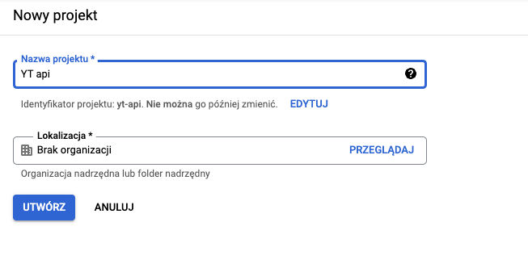
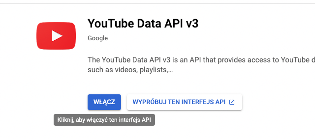
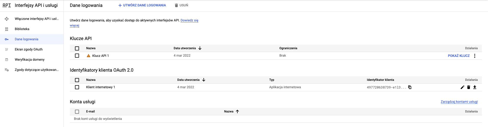

# Youtube

Package Youtube integration

## What does it do

This package is used for creating Youtube livestream for Webinar in EscolaLms.

## Installing

- `composer require escolalms/youtube`
- configure integration in [https://console.cloud.google.com/](https://console.cloud.google.com/)

## Configuration in console cloude youtube
Login in console cloud google and create new project

After created project got to the interfaces api and enable YouTube Data API v3

Go to Login Data and create Api key and OAuth 2.0 client IDs and enter data for variables:
- `services.youtube.client_id`
- `services.youtube.client_secret`
- `services.youtube.api_key`
- `services.youtube.redirect_url`

After entered data, you must generate refresh token.
If you generated refresh token with api from endpoints:
- `api/admin/g-token/generate POST {"email": "email"} AUTHORIZE` and opened generated url and follow the instructions
- After action upper yt generated refresh token for variable `services.youtube.refresh_token`
  Or you can generated refresh token manual and enter for variable `services.youtube.refresh_token`

## Tests

Run `./vendor/bin/phpunit --filter=Youtube` to run tests. See [tests](https://github.com/EscolaLMS/Youtube/tree/main/tests) folder as it's quite good staring point as documentation appendix.

Test details  
